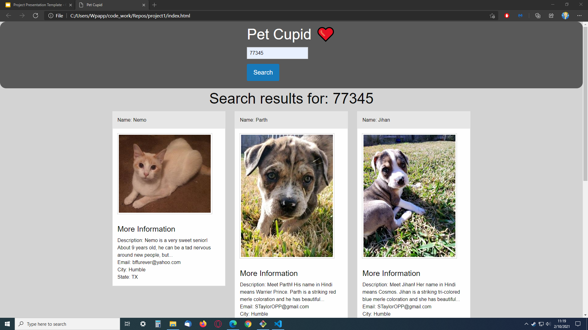

# Pet Cupid
* The motivation for this project was to test our API skills and deliver a full web app from scratch.

# How it works
* The site is very simple to use.  Jusst type in a zip code in the search bar.
* Upon submission, the user will see 6 cards with info about the local animals up for adoption in the area of the given zip.
* The info cards display the animals:
    * Name
    * Description
    * A contact email to contact the shelter
    * City
    * State
* The site uses OAuth API with a token fetch system. As well as two random picture APIs. 

# Link
https://wrp90.github.io/project1/

# Screen Shot 

