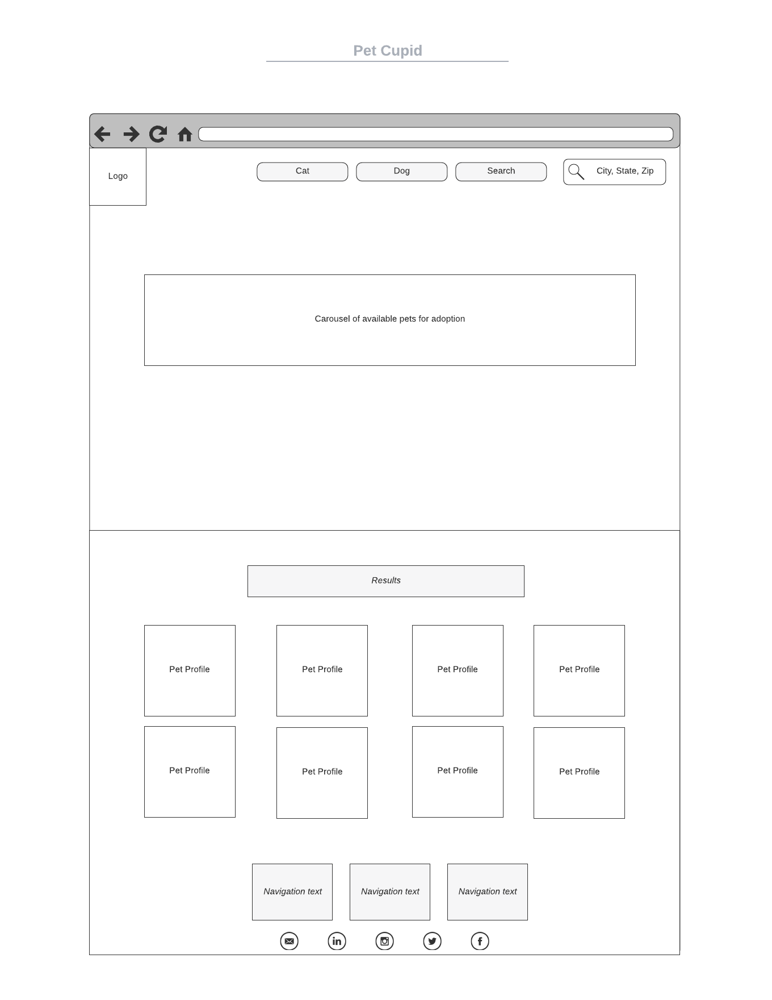

# pet-cupid

## project-description
* pet cupid is a pet finder app that will dynamically find pets available for adoption. the user can select from an attribute list within their geographical location.
* the user is a potential pet owner looking to adopt.

## user-story
* AS A potential pet owner 
* I WANT to find local pets available for adoption
* SO THAT i can find the best match near me

## api's used
* https://www.petfinder.com/
* additional pet-finder api link: https://www.petfinder.com/developers/v2/docs/
* https://cloud.google.com/maps-platform/?utm_source=google&utm_medium=cpc&utm_campaign=FY18-Q2-global-demandgen-paidsearchonnetworkhouseads-cs-maps_contactsal_saf&utm_content=text-ad-none-none-DEV_c-CRE_460848633508-ADGP_Hybrid%20%7C%20AW%20SEM%20%7C%20BKWS%20~%20Google%20Maps%20API-KWID_43700033921822021-kwd-335425467-userloc_9028078&utm_term=KW_google%20maps%20api-ST_google%20maps%20api&gclid=CjwKCAiApNSABhAlEiwANuR9YFnLbFEupaMp1Ujh3CJFjqP4INI1NJ0o4M83nv-y5EAwWPuexIqMLxoCkUgQAvD_BwE

## wireframe/sketch of design

## task breakdown
* HTML file
* JS file
* CSS file
* link functionality of pet finder api to our web application
* link functionality of google maps api to our web application
* link functionality between google maps api and pet finder api
* add ability for user to select between cat's or dogs attribute
